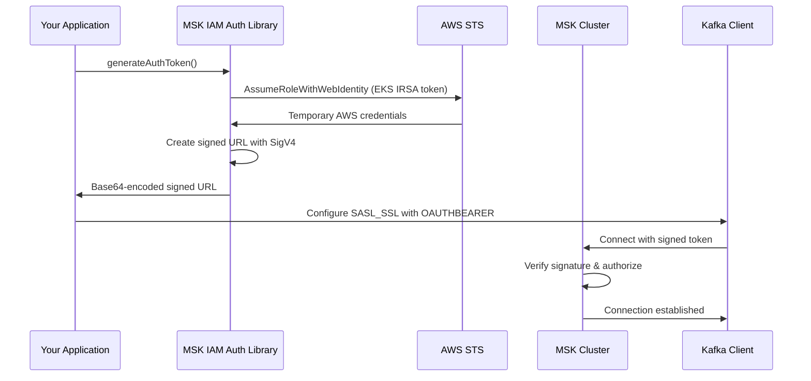

# AWS MSK IAM Authentication - How It Works

## Overview

This library implements AWS MSK (Managed Streaming for Apache Kafka) IAM authentication by generating signed URLs that
prove your identity to the MSK cluster. The authentication follows the AWS Signature Version 4 (SigV4) signing process.

## What is MSK IAM Authentication?

AWS MSK supports IAM-based authentication as an alternative to traditional username/password or certificate-based
authentication. Instead of managing Kafka-specific credentials, you can use AWS IAM roles and policies to control access
to your MSK cluster.

### Key Benefits:

1. **No Kafka-specific credentials** - Use existing AWS IAM infrastructure
2. **No hassle with ACLs** - Leverage IAM policies for access control
2. **Fine-grained permissions** - Control access at topic, consumer group, and operation level
3. **Temporary credentials** - Automatic rotation via AWS STS
4. **Audit trail** - All access logged in AWS CloudTrail

## Authentication Flow



## What `generateAuthToken()` Actually Returns

**Important Clarification:** The `generateAuthToken()` method doesn't return a traditional "token" - it returns a *
*base64-encoded signed URL** that serves as an OAuth Bearer token.

### The Process:

1. **Get AWS Credentials**
    - In EKS: Exchange service account token for temporary AWS credentials via STS
    - In EC2: Retrieve credentials from instance metadata service

2. **Create HTTP Request**
   ```
   GET /?Action=kafka-cluster:Connect HTTP/1.1
   Host: kafka.eu-central-1.amazonaws.com
   ```

3. **Sign with AWS SigV4**
    - Add AWS signature headers (X-Amz-Algorithm, X-Amz-Credential, etc.)
    - Calculate signature using AWS signing algorithm
    - Create a presigned URL

4. **Example Signed URL:**
   ```
   https://kafka.eu-central-1.amazonaws.com/?Action=kafka-cluster%3AConnect&X-Amz-Algorithm=AWS4-HMAC-SHA256&X-Amz-Credential=ASIA...%2F20231201%2Feu-central-1%2Fkafka-cluster%2Faws4_request&X-Amz-Date=20231201T120000Z&X-Amz-Expires=900&X-Amz-Security-Token=...&X-Amz-SignedHeaders=host&X-Amz-Signature=abc123...
   ```

5. **Base64 Encode**
    - The complete signed URL is base64-encoded
    - This encoded string becomes the OAuth Bearer token

6. **Result:**
   ```
   aHR0cHM6Ly9rYWZrYS5ldS1jZW50cmFsLTEuYW1hem9uYXdzLmNvbS8_QWN0aW9uPWthZmthLWNsdXN0ZXI...
   ```

## How Kafka Clients Use This Token

### 1. SASL OAUTHBEARER Configuration

```php
$conf = new RdKafka\Conf();
$conf->set('bootstrap.servers', 'your-msk-broker:9098');
$conf->set('security.protocol', 'SASL_SSL');
$conf->set('sasl.mechanism', 'OAUTHBEARER');

// The "token" is actually the base64-encoded signed URL
$oauthToken = $auth->generateAuthToken();
$conf->set('sasl.oauthbearer.token', $oauthToken);

$producer = new RdKafka\Producer($conf);
```

### 2. What Happens Behind the Scenes

1. **Kafka client** receives the base64-encoded token
2. **During SASL handshake**, the client sends this token to the MSK broker
3. **MSK broker** decodes the base64 string back to the signed URL
4. **MSK service** validates the signature using AWS authentication infrastructure
5. **If valid**, the broker grants access according to the IAM role's permissions

## Technical Implementation Details

### AWS SigV4 Signing Process

The library implements the complete AWS Signature Version 4 algorithm:

1. **Create Canonical Request**
   ```
   GET
   /
   Action=kafka-cluster%3AConnect&X-Amz-Algorithm=AWS4-HMAC-SHA256&...
   host:kafka.eu-central-1.amazonaws.com

   host
   <empty-string-sha256-hash>
   ```

2. **Create String to Sign**
   ```
   AWS4-HMAC-SHA256
   20231201T120000Z
   20231201/eu-central-1/kafka-cluster/aws4_request
   <canonical-request-sha256-hash>
   ```

3. **Calculate Signature**
   ```php
   $kDate = hash_hmac('sha256', $date, 'AWS4' . $secretKey, true);
   $kRegion = hash_hmac('sha256', $region, $kDate, true);
   $kService = hash_hmac('sha256', 'kafka-cluster', $kRegion, true);
   $kSigning = hash_hmac('sha256', 'aws4_request', $kService, true);
   $signature = hash_hmac('sha256', $stringToSign, $kSigning);
   ```

### EKS Service Account Integration

For EKS deployments, the authentication chain is:

1. **Kubernetes Service Account** - Annotated with IAM role ARN
2. **EKS automatically injects:**
    - `AWS_ROLE_ARN` environment variable
    - `AWS_WEB_IDENTITY_TOKEN_FILE` pointing to the service account token
3. **Library reads the service account token** - JWT signed by EKS
4. **STS AssumeRoleWithWebIdentity** - Exchanges the JWT for AWS credentials
5. **Temporary credentials used for signing** - AccessKeyId, SecretAccessKey, SessionToken

### Token Expiration

- **Default expiration:** 900 seconds (15 minutes)
- **Controlled by:** The `X-Amz-Expires` parameter in the signed URL
- **Automatic refresh:** Your application should regenerate tokens before expiration
- **Best practice:** Refresh tokens every 10-12 minutes

## Security Considerations

### 1. Signature Validation

- MSK validates the signature using AWS's internal authentication service
- Tampering with any part of the signed URL invalidates the signature
- Timestamps prevent replay attacks

### 2. IAM Role Permissions

The IAM role must have specific MSK permissions:

```json
{
  "Effect": "Allow",
  "Action": [
    "kafka-cluster:Connect",
    "kafka-cluster:ReadData",
    "kafka-cluster:WriteData"
  ],
  "Resource": "arn:aws:kafka:eu-central-1:123456789012:cluster/your-cluster/*"
}
```

### 3. Network Security

- All communication with MSK uses TLS (port 9098)
- SASL authentication happens over the encrypted connection
- The signed URL contains temporary credentials, not permanent keys

## Troubleshooting

### Common Issues

1. **"Invalid signature" errors**
    - Check system clock synchronization
    - Verify AWS region matches MSK cluster region
    - Ensure IAM role has correct permissions

2. **"Token expired" errors**
    - Implement token refresh logic
    - Check if system time is correct
    - Verify credential expiration times

3. **"Access denied" errors**
    - Verify IAM role policies
    - Check MSK cluster access policies
    - Ensure service account is correctly annotated

### Debugging

Enable debug mode to see the credential resolution process:

```php
class DebugMskIamAuth extends MskIamAuth
{
    protected function getCredentials(): array
    {
        echo "Resolving AWS credentials...\n";
        $creds = parent::getCredentials();
        echo "Using access key: " . substr($creds['accessKeyId'], 0, 10) . "...\n";
        echo "Session token present: " . (isset($creds['sessionToken']) ? 'Yes' : 'No') . "\n";
        return $creds;
    }
}
```

## Integration Examples

### Symfony Application

```php
// Service configuration
class KafkaService
{
    private MskIamAuth $auth;

    public function __construct(string $awsRegion)
    {
        $this->auth = new MskIamAuth($awsRegion);
    }

    public function getKafkaConfig(): array
    {
        return [
            'bootstrap.servers' => $_ENV['MSK_BOOTSTRAP_SERVERS'],
            'security.protocol' => 'SASL_SSL',
            'sasl.mechanism' => 'OAUTHBEARER',
            'sasl.oauthbearer.token' => $this->auth->generateAuthToken()
        ];
    }
}
```

### Background Workers

```php
// Refresh token periodically
class KafkaConsumer
{
    private MskIamAuth $auth;
    private DateTime $tokenExpiry;

    public function consume(): void
    {
        while (true) {
            // Refresh token every 10 minutes
            if (!$this->tokenExpiry || $this->tokenExpiry <= new DateTime('+5 minutes')) {
                $this->refreshToken();
            }

            // Consume messages...
        }
    }

    private function refreshToken(): void
    {
        $token = $this->auth->generateAuthToken();
        $this->consumer->setOAuthToken($token);
        $this->tokenExpiry = new DateTime('+15 minutes');
    }
}
```

## Conclusion

The AWS MSK IAM authentication library provides a secure, AWS-native way to authenticate with MSK clusters. By
understanding that the "token" is actually a base64-encoded signed URL, developers can better integrate this
authentication mechanism into their applications and troubleshoot any issues that arise.

The key insight is that this approach leverages AWS's existing authentication infrastructure, eliminating the need for
separate credential management while providing fine-grained access control through IAM policies.